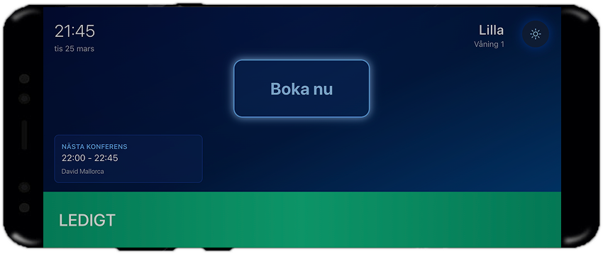
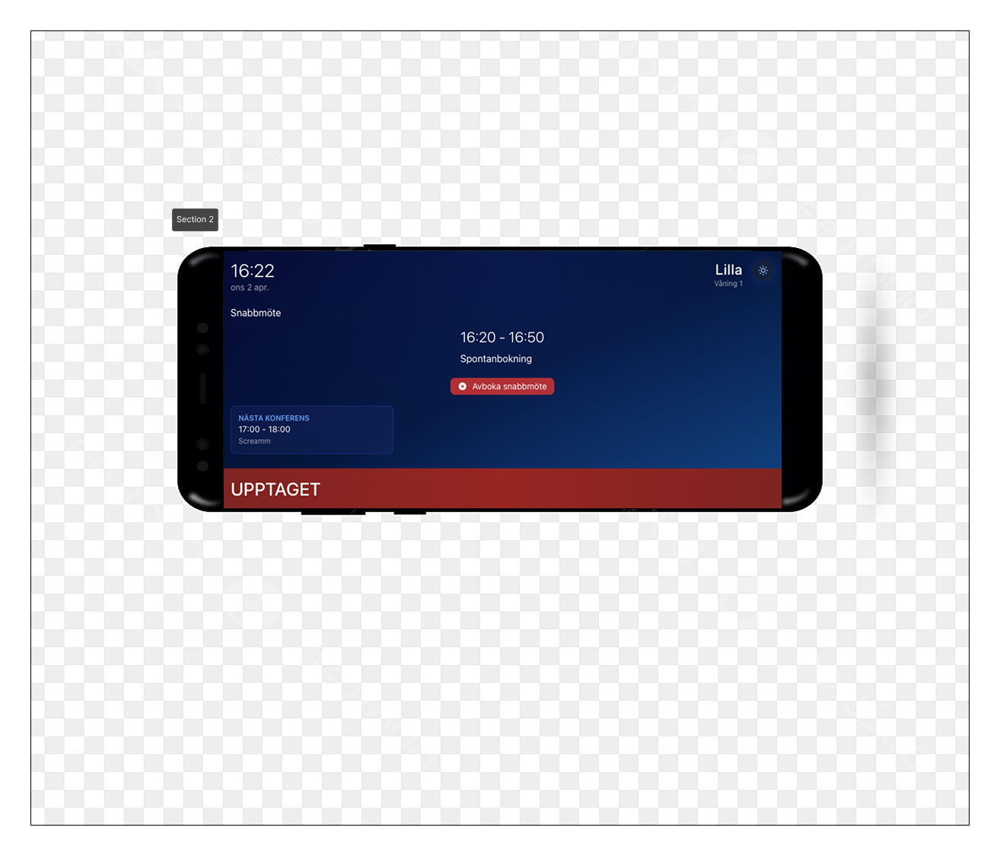
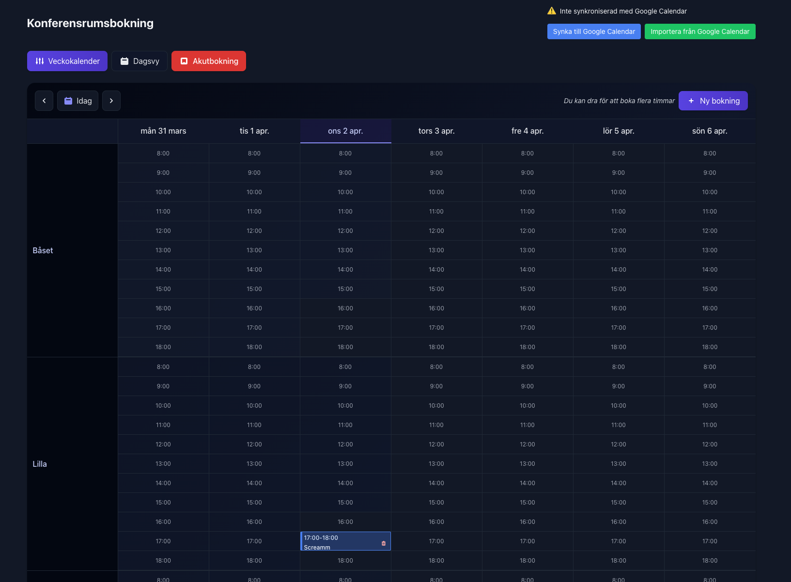
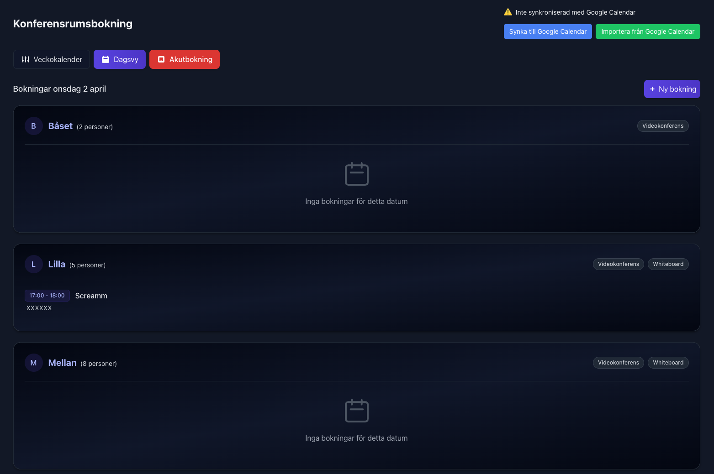

# Room Booking & Display System

<div align="center">


A modern, responsive room booking and display system with real-time updates via WebSockets, sci-fi inspired UI, and edge-native backend.

[Features](#features) • [Screenshots](#screenshots) • [Tech Stack](#tech-stack) • [Getting Started](#getting-started)

</div>

## Live

- **Booking app:** https://sjobergska-rod.pages.dev
- **Room display:** `https://sjobergska-rod.pages.dev/display/<room-name>` (e.g. `/display/Stora%20salen`)
- **API:** https://sjobergska-api.davidrydgren.workers.dev

## Screenshots

<div align="center">

### Room Display - Available


### Room Display - Occupied


### Booking System - Week View


### Booking System - List View


</div>

## Features

| Core | UI/UX | Technical |
|------|-------|-----------|
| Real-time booking system | Sci-fi inspired themes | TypeScript |
| Quick booking (one click) | Responsive / mobile-first | Cloudflare Workers + D1 |
| Room display for tablets/screens | Light/Dark themes | WebSocket real-time updates |
| Conflict detection | Animated backgrounds | Edge-native, no cold starts |

### Quick Booking
- One-click booking directly from the room display
- Smart time slot allocation (default 1h)
- Automatic conflict detection
- Cancel quick bookings directly on the display screen
- Emergency button — books the largest available room instantly

### Room Display
- Designed for old tablets and displays mounted outside rooms
- Shows current status (LEDIGT / UPPTAGET), current booking and next upcoming meeting
- Auto-reconnecting WebSocket for real-time updates
- Fallback polling every 60s if WebSocket drops

## Tech Stack

| Frontend | Backend | Database |
|----------|---------|----------|
| React 19 + TypeScript | Cloudflare Workers | Cloudflare D1 (SQLite at edge) |
| Vite | Durable Objects (WebSocket) | Migrations via wrangler |
| Tailwind CSS | REST API | Seeded rooms on deploy |
| Cloudflare Pages | Native `fetch` (no SDK) | |

## Getting Started

### Prerequisites
- Node.js 18+
- [Wrangler CLI](https://developers.cloudflare.com/workers/wrangler/) (`npm i -g wrangler`)
- Cloudflare account (free tier works)

### Local development

```bash
# Clone
git clone https://github.com/screamm/Room-Booking-Display-System.git
cd Room-Booking-Display-System

# Frontend deps
npm install

# Worker deps
cd worker && npm install && cd ..

# Start Worker locally (in one terminal)
cd worker && npx wrangler dev --local

# Start frontend (in another terminal)
npm run dev
```

### Environment variables

Create `.env.local` in the root:

```env
VITE_API_URL=http://localhost:8787
VITE_ACCESS_PIN=1234
```

For production, set `VITE_API_URL` to your deployed worker URL in Cloudflare Pages dashboard.

### Deploy

```bash
# 1. Deploy Worker + create D1 database
cd worker
npx wrangler d1 create sjobergska-db          # only first time
npx wrangler d1 execute sjobergska-db --file schema.sql --remote
npx wrangler deploy

# 2. Deploy frontend to Cloudflare Pages
npm run build
npx wrangler pages deploy dist --project-name sjobergska-rod
```

## Project Structure

```
Room-Booking-Display-System/
├── src/
│   ├── components/
│   │   ├── RoomDisplay.tsx         # Room display (tablet screen mode)
│   │   ├── ConferenceRoomBooking.tsx
│   │   └── ...
│   ├── contexts/                   # Theme, Toast, UserPreferences
│   ├── lib/
│   │   └── api.ts                  # Fetch wrapper for Worker REST API
│   └── types/
│       └── database.types.ts
├── worker/
│   ├── src/
│   │   ├── index.ts                # Cloudflare Worker — REST API
│   │   └── durable-object.ts      # BookingsBroadcaster — WebSocket hub
│   ├── schema.sql                  # D1 schema + seed data
│   └── wrangler.toml
└── docs/
    └── plans/                      # Implementation planning docs
```

## Database Schema (D1 / SQLite)

```sql
CREATE TABLE rooms (
  id INTEGER PRIMARY KEY AUTOINCREMENT,
  name TEXT NOT NULL,
  capacity INTEGER NOT NULL,
  features TEXT NOT NULL DEFAULT '[]',  -- JSON array
  created_at TEXT DEFAULT (datetime('now'))
);

CREATE TABLE bookings (
  id INTEGER PRIMARY KEY AUTOINCREMENT,
  room_id INTEGER NOT NULL REFERENCES rooms(id) ON DELETE CASCADE,
  date TEXT NOT NULL,           -- YYYY-MM-DD
  start_time TEXT NOT NULL,     -- HH:MM
  end_time TEXT NOT NULL,       -- HH:MM
  booker TEXT NOT NULL,
  purpose TEXT,
  booking_type TEXT DEFAULT 'meeting',
  is_quick_booking INTEGER DEFAULT 0,  -- 0/1 (SQLite boolean)
  created_at TEXT DEFAULT (datetime('now')),
  CHECK (start_time < end_time)
);
```

## API Endpoints

| Method | Path | Description |
|--------|------|-------------|
| GET | `/api/rooms` | All rooms |
| GET | `/api/rooms/:id` | Single room |
| POST | `/api/rooms` | Create room |
| PUT | `/api/rooms/:id` | Update room |
| DELETE | `/api/rooms/:id` | Delete room |
| GET | `/api/bookings` | Bookings (optional `?date=`, `?start_date=&end_date=`) |
| POST | `/api/bookings` | Create booking |
| PUT | `/api/bookings/:id` | Update booking |
| DELETE | `/api/bookings/:id` | Delete booking |
| POST | `/api/bookings/check-overlap` | Check for time conflicts |
| GET | `/api/ws/:roomId` | WebSocket upgrade — real-time updates |

## Project Status

| Feature | Status |
|---------|--------|
| Room booking | Stable |
| Room display (tablet) | Stable |
| Quick booking | Stable |
| Real-time WebSocket updates | Stable |
| Dark / light theme | Stable |
| Mobile responsive | Stable |
| Google Calendar integration | Not implemented |

## License

MIT — see [LICENSE](LICENSE) for details.

---

<div align="center">Made with care by Screamm</div>
