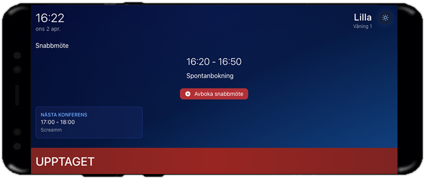
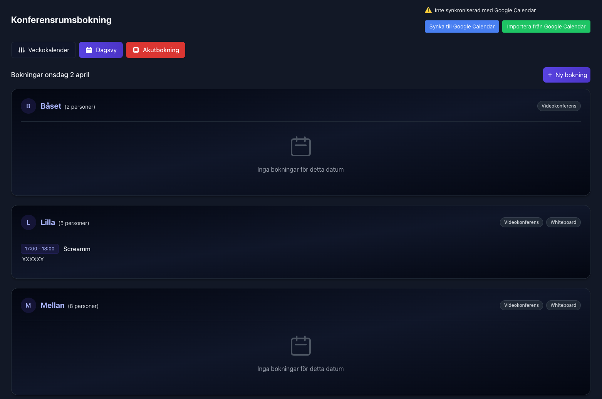

# 🏢 Room Booking & Display System

<div align="center">


A modern, responsive room display and booking system with real-time updates, sci-fi inspired UI and Google Calendar integration.

[Features](#features) • [Screenshots](#screenshots) • [Tech Stack](#tech-stack) • [Getting Started](#getting-started) • [Documentation](#documentation)

</div>

## 📸 Screenshots

Here are some screenshots showing the system's functionality:

<div align="center">

### Room Display - Available Status

<p><em>A room display showing that the room is available, with quick booking functionality and display of the next scheduled meeting.</em></p>

### Room Display - Occupied Status

<p><em>A room display showing that the room is occupied with information about the current meeting and option to cancel quick meetings.</em></p>

### Booking System - Week View

<p><em>The system's week view showing all bookings in a grid layout, with options to create new bookings and view existing ones.</em></p>

### Booking System - List View

<p><em>List view of all rooms and their bookings for a specific day, with detailed information about each booking.</em></p>

</div>

## ⚡ Quick Start

Get started in 30 seconds:

```bash
git clone https://github.com/yourusername/Sjobergska_RoD.git
cd Sjobergska_RoD && npm install
npm run dev
```

Then visit [http://localhost:5173](http://localhost:5173) in your browser.

## ✨ Features

<div align="center">

| 🎯 Core Features | 🎨 UI/UX | 🔧 Technical |
|----------------|----------|-------------|
| • Real-time booking system | • Sci-Fi inspired themes | • TypeScript support |
| • Quick booking functionality | • Responsive design | • Supabase integration |
| • Google Calendar sync | • Modern interactive UI | • PWA support |
| • Room display system | • Light/Dark themes | • Real-time updates |

</div>

### 🚀 Quick Booking
- One-click emergency booking system
- Smart time slot allocation
- Automatic conflict detection
- Real-time availability updates
- Option to cancel quick bookings directly from the display
- Emergency button for immediate booking of largest available room
- Quick, automated booking process for urgent meetings

### 🔄 Google Calendar Integration
- Two-way sync with Google Calendar
- Fetch existing meetings
- Push room bookings to calendar
- Sync status monitoring
- OAuth2 authentication flow

> **Note!** Google Calendar integration is currently under development and not fully tested in production. Use with caution.

### 📱 Room Display
- Dedicated display mode for tablets/screens
- Auto-fullscreen capability
- Real-time room availability status
- Next upcoming meeting info
- Quick booking and cancellation interface

## 🛠️ Tech Stack

<div align="center">

| Frontend | Backend | Styling | Database |
|----------|---------|---------|----------|
| React 19 | Supabase | Tailwind CSS | PostgreSQL |
| TypeScript | REST API | CSS Animations | Row Level Security |
| Vite | Google API | Dark Mode | Real-time Subscriptions |

</div>

## 🚀 Getting Started

### Prerequisites
- Node.js (v16 or newer)
- npm or yarn
- Supabase account
- Google Developer account (for Calendar integration)

### Installation Guide

1. **Clone the repository**
   ```bash
   git clone https://github.com/yourusername/Sjobergska_RoD.git
   cd Sjobergska_RoD
   ```

2. **Install dependencies**
   ```bash
   npm install
   ```

3. **Configure environment variables**
   ```bash
   cp .env.example .env.local
   ```
   Then edit `.env.local` with your specific details.

4. **Start the development server**
   ```bash
   npm run dev
   ```

5. **Open your browser**
   Visit [http://localhost:5173](http://localhost:5173)

## ⚙️ Configuration

### Environment Variables
Create a `.env.local` file in the root directory:

```env
VITE_SUPABASE_URL=your-supabase-url
VITE_SUPABASE_ANON_KEY=your-anon-key
VITE_GOOGLE_CLIENT_ID=your-google-client-id
VITE_GOOGLE_CLIENT_SECRET=your-google-client-secret
VITE_GOOGLE_REDIRECT_URI=http://localhost:5173/auth/google/callback
```

### Database Setup
1. Log in to [Supabase Dashboard](https://app.supabase.com)
2. Create a new project
3. Navigate to SQL Editor
4. Run the setup scripts:

```sql
-- Initialize tables and security policies
-- Run the script from src/scripts/setupDatabase.sql

-- Set up Google Calendar integration
-- Run the script from src/scripts/updateDatabaseForGoogleCalendar.sql
```

## ❓ Frequently Asked Questions (FAQ)

### General Questions
**Q: Can the system be used without an internet connection?**  
A: No, the system requires an internet connection to function properly, especially for real-time features and synchronization.

**Q: Does the system support multiple languages?**  
A: Currently, only English is fully supported, but we plan to add more languages in the future.

**Q: Can I customize the appearance of the room display?**  
A: Yes, you can choose between light and dark themes and customize colors and logos by editing the CSS files.

### Technical Questions
**Q: Which browsers are supported?**  
A: The system supports modern browsers such as Chrome, Firefox, Safari, and Edge.

**Q: Can I integrate with calendar systems other than Google Calendar?**  
A: Currently, only Google Calendar is supported, but we plan to add Microsoft Outlook support in the future.

**Q: How does the PWA support work?**  
A: The system can be installed as a Progressive Web App on mobile devices and computers, providing an app-like experience.

## 📚 Documentation

### Project Structure
```
src/
├── components/     # React components
│   ├── RoomDisplay.tsx            # Room display component
│   ├── CalendarWidget.tsx         # Calendar widget for date selection
│   ├── GoogleCalendarSync.tsx     # Calendar sync component
│   └── ResponsiveBookingForm.tsx  # Booking form component
├── contexts/       # React contexts
│   ├── ThemeContext.tsx           # Theme management
│   ├── ToastContext.tsx           # Toast notifications
│   └── UserPreferencesContext.tsx # User preferences
├── hooks/          # Custom hooks
│   ├── useLocalStorage.ts         # localStorage state management
│   └── useGoogleCalendar.ts       # Google Calendar integration
├── lib/            # Utility functions
│   ├── api.ts                     # API client for Supabase
│   ├── supabase.ts                # Supabase client
│   └── googleCalendarApi.ts       # Google Calendar integration
├── types/          # TypeScript types
│   └── database.types.ts          # Database schema types
└── utils/          # Utility functions
    └── dateUtils.ts               # Date and time utilities
```

### Database Schema
```sql
-- Rooms table
CREATE TABLE rooms (
  id SERIAL PRIMARY KEY,
  name TEXT NOT NULL,
  capacity INTEGER NOT NULL,
  features TEXT[] NOT NULL,
  created_at TIMESTAMP WITH TIME ZONE DEFAULT CURRENT_TIMESTAMP
);

-- Bookings table
CREATE TABLE bookings (
  id SERIAL PRIMARY KEY,
  room_id INTEGER NOT NULL REFERENCES rooms(id) ON DELETE CASCADE,
  date DATE NOT NULL,
  start_time TIME NOT NULL,
  end_time TIME NOT NULL,
  booker TEXT NOT NULL,
  purpose TEXT,
  booking_type TEXT,
  is_quick_booking BOOLEAN DEFAULT FALSE,
  google_calendar_id TEXT,
  last_synced TIMESTAMP WITH TIME ZONE,
  sync_status TEXT DEFAULT 'pending',
  created_at TIMESTAMP WITH TIME ZONE DEFAULT CURRENT_TIMESTAMP,
  CONSTRAINT time_check CHECK (start_time < end_time)
);
```

### Available Scripts
```bash
npm run dev         # Start development server
npm run build       # Build for production
npm run preview     # Preview production build
npm run setup-db    # Run database setup script
npm test            # Run tests
npm run test:watch  # Run tests in watch mode
npm run test:coverage # Run tests and generate coverage report
npm run test:ci     # Run tests in CI environment
npm run test:db     # Test database connection
npm run test:db:integrity # Test database data integrity
npm run test:db:all # Run all database tests
npm run lint        # Run ESLint
```

## 🔒 Security

- Row Level Security (RLS) with Supabase
- OAuth2 authentication for Google API
- Environment variable protection
- Secure API endpoints

## 📊 Project Status

| Feature | Status | Notes |
|---------|--------|-------|
| Room Booking | ✅ Stable | Core functionality tested and working |
| Room Display | ✅ Stable | Core functionality tested and working |
| Quick Booking | ✅ Stable | Fully implemented with emergency button |
| Google Calendar Integration | ⚠️ Beta | Under development, not fully tested |
| Mobile Interface | ✅ Stable | Responsive design implemented |
| Dark Mode | ✅ Stable | Fully implemented with user preferences |

## 🎨 Customization

### Themes
The application supports both dark and light sci-fi inspired themes. Theme selection is saved in local storage for a consistent experience.

```javascript
// Example of theme switching
const { darkMode, toggleDarkMode } = useTheme();
```

### User Preferences
The app stores user preferences to provide a personalized experience:

- Default booking duration
- Theme preference
- Preferred room
- Booker name

## 📞 Contact & Support

Have questions or need help? Contact us!

- **Email:** support@sjobergska.com
- **GitHub:** [Report Issues](https://github.com/yourusername/Sjobergska_RoD/issues)
- **Web:** [www.sjobergska.com](https://www.sjobergska.com)

Support hours: Weekdays 8:00 AM - 5:00 PM CET

## 🤝 Contributing

1. Fork the repository
2. Create your feature branch (`git checkout -b feature/AmazingFeature`)
3. Commit your changes (`git commit -m 'Add some AmazingFeature'`)
4. Push to the branch (`git push origin feature/AmazingFeature`)
5. Open a Pull Request

## 📄 License

This project is licensed under the MIT License - see the [LICENSE](LICENSE) file for details.

---

<div align="center">

Made with ❤️ for Development by Screamm

</div> 